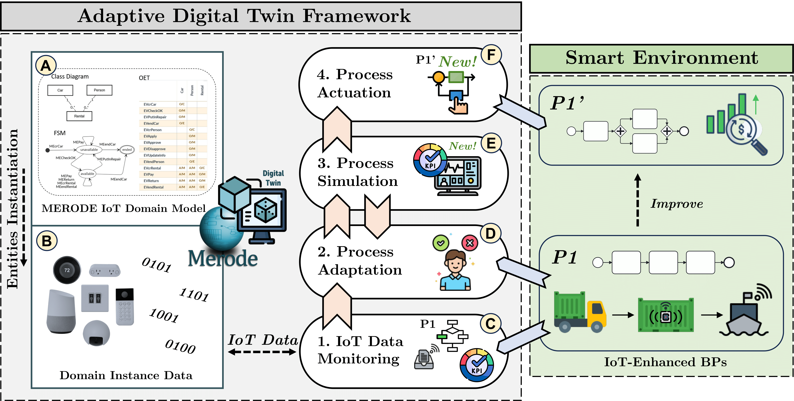

# ADAPTIVE TWIN

ADAPTIVE TWIN is a novel framework for continuously optimizing and adapting IoT-Enhanced Business Processes. It leverages the DT paradigm to create virtual replicas of IoT system entities, enabling real-time synchronization and dynamic updates of the digital entities involved in the processes. The framework aims to optimize process performance and achieve competitive real-time alignment between business operations and IT.

# Table of contents
<!--ts-->
   * [Functionalities](#functionalities)
   * [How to run](#how-to-run)
<!--te-->

# Functionalities

ADAPTIVE TWIN aims to improve and adapt IoT-Enhanced Business Processes continuously, considering both direct changes (i.e., adding new resources or activities) and indirect changes (i.e., responding to changing environmental or customer needs). An IoT-Enhanced Business Process refers to a service operating in a business scenario influenced or enhanced by integrating IoT-derived information. Unlike traditional DTs, which rely on static and predefined services, our approach focuses on strategies supporting ongoing optimization and adaptation of IoT-Enhanced Business Processes through simulation-driven adaptation.
IoT-derived information is integrated into the process using an accurate and generalizable IoT domain model based on the MERODE model-driven approach. MERODE proves particularly valuable for modeling data-aware processes, offering comprehensive coverage of BALSA dimensions (Business Objects, Lifecycles, Services, Associations) within business processes. It enables the definition of life cycles for business objects, providing a solid foundation for modeling information systems consistently and comprehensively. This integration fosters a unified view of data and processes, enhancing coherence and alignment between operational activities and domain concepts. 

<p align="center">

</p>

To represent the IoT system's components, we mapped two well-known and generally accepted ontologies, the Semantic Sensor Network (SNN) and Sensor, Observation, Sample, and Actuator (SOSA) into a MERODE Domain Model for IoT (A).  The domain model allows for the instantiation of IoT system entities by generating virtual replicas that synchronize with their physical counterparts' data, state, and characteristics at runtime. Once the virtual replicas of IoT system entities are instantiated (B), and it is possible to access their IoT-related information. Then, IoT data monitored in real-time from the virtual replicas can be considered in the modeling of business processes (C). In this step, some filtering and pre-processing operations can be applied to make data exploitable by the process. 
At this point, to assess the performance of the actual IoT-Enhanced Business Process (P1) in a real-world business setting, we leverage KPIs derived from the existing information systems that implement the process. If KPI values indicate suboptimal performance of the actual process (P1), a process adaptation is initiated manually (D). 
Next, the user defines a set of simulation parameters (E) to run the simulation and obtain output KPIs for evaluating the performance of the adapted process (P1').
During the process adaptation (D) and simulation (E) phases, it is possible to compare different process versions (e.g., by changing the resources involved or by implementing structural changes) against the obtained KPIs to achieve better process improvements. The adaptation and simulation steps may require multiple iterations until desired KPIs values are achieved.
Finally, after obtaining an optimal version of the process, it is possible to proceed to its actuation (F). 
In line with the DT paradigm, changes in the digital world will be reflected in the real world, since IoT entities are integrated as digital actors in the process. This ensures strict synchronization with physical entities, allowing the process to adapt dynamically to contextual variations and directly impact activities in the physical world, ensuring a real-time alignment with the real world. 
Ultimately, the new process (P1') initiated during the (F) phase can be optimized by restarting from phase (C).


# How To Run

## Prerequisites

- [Node](https://nodejs.org/en) 16.14 or later;
- [JDK](https://www.oracle.com/java/technologies/javase/jdk19-archive-downloads.html) 19 or later (Be sure that you have set the JAVA_HOME environment variable pointing to version 19 of the Java JDK);
- [Python](https://www.python.org/downloads/) 3.9.X or higher.

There are two ways to run ADAPTIVE TWIN:

1. Clone this repository and run the tool locally by executing the following command:

```bash
\.mvnw
```
Once launched, the application will be available at [http://localhost:8080](http://localhost:8080).

2. Import the project into an IDE and run the class "Application.java"
