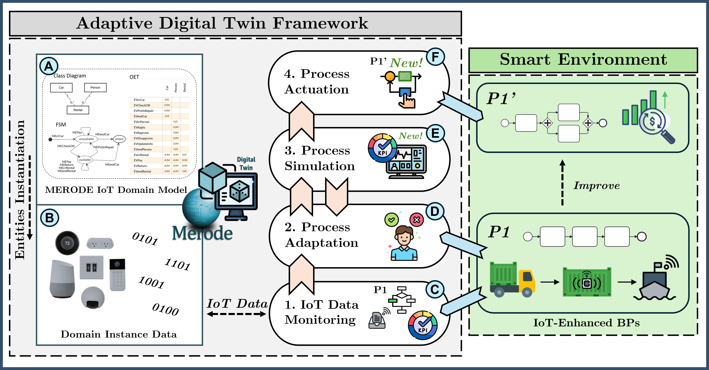
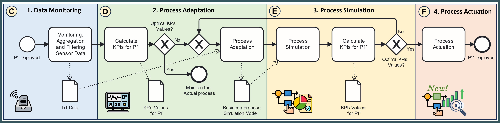

# ADAPTIVE-TWIN

<p align="center">

</p>

<p align="center">
  
  <a href="https://github.com/vaadin/hilla/releases"></a>  
  
  
</p>

ADAPTIVE SHADOW is a web application that aims to model and continuously optimize IoT-Enhanced Business Processes using the BPMN 2.0 language.

The framework is made available through a RESTful web application that allows users to:
- Instantiate a Domain Model for IoT thus generating Digital Shadows of IoT components;
- Model a BPMN scenario leveraging Digital Shadows for IoT components;
- Simulate the BPMN model and obtain feedback and insights for the process improvement.

# Table of contents
<!--ts-->
   * [Functionalities](#Functionalities)
   * [How to run](#how-to-run)
   * [Domain Model](#domain-model)
   * [References](#References)
   * [License](#License)
<!--te-->

# Functionalities

The implementation of the framework consists of two parts: (i) instantiating Digital Shadows for digitizing IoT entities using the IoT MERODE Domain Model, and (ii) the BPM infrastructure for the optimization of IoT-Enhanced Business Processes which integrate Digital Shadows of IoT entities. 

<p align="center">

</p>

To represent the IoT system's components, we mapped two well-known and generally accepted ontologies, the Semantic Sensor Network (SNN) and Sensor, Observation, Sample, and Actuator (SOSA) into a MERODE Domain Model for IoT (A). 
The domain model allows for the instantiation of IoT system entities by generating Digital Shadows that synchronize with their physical counterparts' data, state, and characteristics at runtime. 
Once the virtual replicas of IoT system entities are instantiated (B), IoT data can be monitored in real-time from the virtual replicas and can be considered in the modeling of business processes (C). In this step, some filtering and pre-processing operations can be applied to make data exploitable by the process. 
At this point, to assess the performance of the actual IoT-Enhanced Business Process (P1) in a real-world business setting, we leverage KPIs derived from the existing information systems that implement the process. 
If KPI values indicate suboptimal performance of the actual process (P1), a process adaptation is initiated manually (D). 
Next, the user defines a set of simulation parameters (E) to run the simulation and obtain output KPIs for evaluating the performance of the adapted process (P1').
During the process adaptation (D) and simulation (E) phases, it is possible to compare different process versions (e.g., by changing the resources involved or by implementing structural changes) against the obtained KPIs to achieve better process improvements. The adaptation and simulation steps may require multiple iterations until desired KPIs values are achieved.
Finally, after obtaining an optimal version of the process, it is possible to proceed to its manual actuation (F). 
In line with the Digital Business Process Shadow concept, the optimized version P1' represents a shadow of the actual process P1. 
The process P1' suggests and drives the real-world implementation of the improvements resulting from the analyses performed through the simulations.
However, implementing the optimized version of the process in a real-world setting can require direct human oversight if the optimization process requires acting on tasks related to IoT device operations. To provide an example, changes in IoT device configuration and setups often require manual intervention such as sensor repositioning or infrastructure modifications that automated systems cannot fully manage independently. As such, while the process simulations and enhancements derived from them can be automated to a large extent, reflecting these changes in the real world demands hands-on management. Finally, worth noticing, that the new process P1' actuated during the (F) phase can be optimized by restarting from phase (C) thus starting a continuous feedback loop.


<p align="center">

</p>

# How to run

## Prerequisites

- [Node](https://nodejs.org/en) 20.12.2 or later;
- [JDK](https://www.oracle.com/java/technologies/javase/jdk19-archive-downloads.html) 17 or later (Be sure that you have set the JAVA_HOME environment variable pointing to version 17 of the Java JDK);
- [Maven](https://maven.apache.org/download.cgi) 3.9.5 or later;

There are several ways to run ADAPTIVE-SHADOW:

<details>
<summary>1 Using cmd</summary>
<br>
1. First of all, clone this repository and run the following command to install dependencies:

```bash
yarn install
```

1.1 Run the tool locally by executing the following command:

for Windows:
```bash
.\mvnw
```
for macOS / Linux:
```bash
./mvnw
```

Once launched, the application will be available at [http://localhost:8080](http://localhost:8080).
<br><br>
</details>

<details>
<summary>2 Import the project into an IDE</summary>
<br>
  
2.1 First of all, clone this repository and run the following command to install dependencies:

```bash
yarn install
```

2.2 Run the Application.java class using Spring:

```bash
 ADAPTIVE-SHADOW\src\main\java\com\example\application\Application.java
```

Once launched, the application will be available at [http://localhost:8080](http://localhost:8080).
<br><br>
</details>


<details>
<summary>3 Using Docker (Recommended!)</summary>
<br>
  
3.1 Use the docker image "Dockerfile" present in the folder of the project or available online at [DockerHub](https://hub.docker.com/r/ivanpd/adaptive-shadow);
   
- Generate the .jar file for building the image   
```bash
mvn clean package -Pproduction
```
- Creating the Docker image from the main folder of the project by executing the following comand:

```bash
docker build -t adaptive-shadow-image .
```
- Run the Docker container from the main folder of the project by executing the following comand:

```bash
docker run -p 8080:8080 adaptive-shadow-image
```
Once launched, the application will be available at [http://localhost:8080](http://localhost:8080).

<br><br>
</details>

NOTE: After starting the application you need to run 3 batch files in the following order:

- ADAPTIVE-SHADOW\IoT-EDG-Rest-Services\extras\start-db-server.bat
- ADAPTIVE-SHADOW\IoT-EDG-Rest-Services\extras\init-db.bat
- ADAPTIVE-SHADOW\IoT-EDG-Rest-Services\extras\start-service.bat

This allows you to start the Domain Model API orchestrator allowing you to instantiate the Digital Shadows.
If everything is set up correctly, the API orchestrator will appear "online" as depicted in the following figure:

<p align="center">

</p>

# Domain Model Specification

To represent the IoT system's components, two well-known and generally accepted ontologies, the Semantic Sensor Network (SNN) and Sensor, Observation, Sample, and Actuator (SOSA) were mapped into a MERODE Domain Model for IoT [1]. 
The domain model allows for the instantiation of IoT system entities by generating Digital Shadows that synchronize with their physical counterparts' data, state, and characteristics in real-time. 

MERODE is a model-driven engineering approach that -besides a focus on model quality- includes an incremental development strategy that ensures a well-structured and scalable system that represents an effective base for capturing domain-specific knowledge and establishing effective information systems. This approach relies on the concept of Model-Driven Engineering (MDE) placing a strong focus on ensuring the quality of the data produced and managed by a standard model mapped from the Semantic Sensor Network (SSN) and SOSA Ontology.

## Graphs

Detailed information about the Domain Model can be found in: [1]

<p align="center">

</p>

## Attributes

| UML Class | Attribute Name | Type | Description |
| --- | --- | --- | --- |
| **Platform** | Name | `STRING` | Name of the Platform |
|  | Description | `LONG TEXT` | Description of the Platform |
|  | hostedBy | `LONG TEXT` | Entity on which the Platform is hosted |
| **FeatureOfInterest** | Name | `STRING` | Name of the Feature of Interest |
|  | Description | `LONG TEXT` | Description of the Feature of Interest |
| **Device** | Name | `STRING` | Name of the Feature of Interest |
|  | Description | `LONG TEXT` | Description of the Feature of Interest |
|  | Status | `BOOLEAN` | Value of the Device Status. 1 represent ON, while 0 OFF  |
| **RegisteredDevice** | deviceName | `STRING` | Name of the Device registered |
|  | platformName | `LONG TEXT` | Name of the Platform registered  |
|  | startTime | `DATE/TIME` | Device registration time stamp |
| **RegisteredPlatform** | platformName | `STRING` | Name of the Platform registered |
|  | featureofinterestName | `LONG TEXT` | Name of the Feature of Interest registered  |
|  | startTime | `DATE/TIME` | Platform registration time stamp |
| **Property** | featureofinterestName | `LONG TEXT` | Name of the Feature of Interest registered  |
|  | description | `LONG TEXT` | Description of the Property to be measured from the Feature of Interest |
| **Procedure** |  deviceName | `STRING` | Name of the Device registered |
|  | description | `LONG TEXT` | Description of the device's Procedure to perform a measurement |
| **DeviceUsage** | usageType | `STRING` | Name of the Platform |
|  | startTime | `DATE/TIME` | Device usage time stamp start |
|  | endTime | `DATE/TIME` | Device usage time stamp end |
| **DeviceResult** | value | `FLOAT` | Measured value |
| | unit | `STRING` | Measured value unit |
| | producedBy | `STRING` | Device Reference |
| | startTime | `DATE/TIME` | Measurement time stamp start |
|  | endTime | `DATE/TIME` | Measurement time stamp end |

The MERODE Domain Model can be processed by the MERLIN Code Generator, which provides the option to generate two different types of code: a Java prototype of the application or a RESTful web application. Both solutions adhere to the logic defined in the domain model and are included in the project folder.

## The Java Prototype

The Java prototype encompasses a straightforward Graphical User Interface (GUI) displaying a list and details of the objects defined in the domain model. It also offers buttons for creating, modifying, and terminating object instances.

The Domain Model can be tested in the GUI offered by MERODE, by directly executing the RUN file at the following path of the project:

```bash
ADAPTIVE-SHADOW\Domain Model\DS_GUI_Prototype\RUN 
```

<p align="center">
  
  
</p>

## The RESTful Web Application for using the Domain Model

The RESTful web application consists of a MAVEN project, offering a range of API services for each business event. The Domain Layer defines several business object types (EDG), each of which has a corresponding set of business event types specified in the Service Layer (OET). These business event types, which encompass actions such as creation, modification, termination, and more, can be performed through API services.

ADAPTIVE SHADOW directly implements the APIs necessary to instantiate the Domain Model in the web application of this project.

# References

[1] Compagnucci, I., Serral, E., Snoeck,M. (2023). Supporting Digital Twins Systems Integrating the MERODE Approach. International Conference on Model Driven Engineering Languages and Systems Companion (MODELS-C),  pp. 449-458. ACM/IEEE.

# License

ADAPTIVE SHADOW is under the [MIT](https://github.com/IvanComp/ADAPTIVE-SHADOW/blob/main/LICENSE) license.
