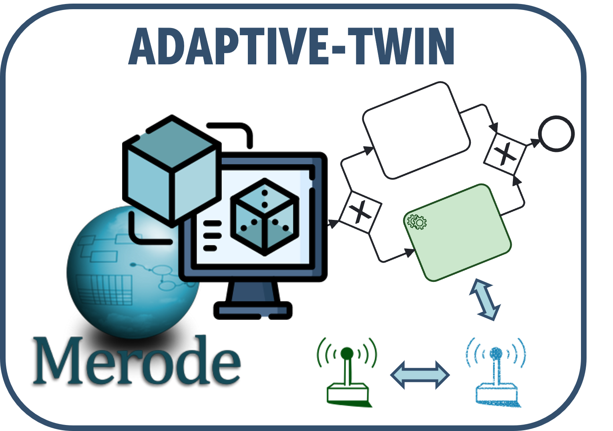

# ADAPTIVE-SHADOW

<p align="center">

</p>

<p align="center">
  
  <a href="https://github.com/vaadin/hilla/releases"></a>  
  
  
</p>

ADAPTIVE SHADOW is a web application that aims to model and optimize IoT-Enhanced Business Processes continuously. 
The implementation of the framework consists of two parts: \textit{(i)} instantiating Digital Shadows for digitizing IoT entities using the IoT MERODE Domain Model, and \textit{(ii)} the BPM infrastructure for the optimization of IoT-Enhanced Business Processes which integrate Digital Shadows of IoT entities. 

# Table of contents
<!--ts-->
   * [Functionalities](#functionalities)
   * [How to run](#how-to-run)
   * [Domain Model](#domain-model)
<!--te-->

# Functionalities


<p align="center">

</p>


# How to run

## Prerequisites

- [Node](https://nodejs.org/en) 16.14 or later;
- [JDK](https://www.oracle.com/java/technologies/javase/jdk19-archive-downloads.html) 19 or later (Be sure that you have set the JAVA_HOME environment variable pointing to version 19 of the Java JDK);
- [Python](https://www.python.org/downloads/) 3.9.X or higher.

There are several ways to run BPMN Inspector:

1. Clone this repository and run the tool locally by executing the following command:

```bash
\.mvnw
```
Once launched, the application will be available at [http://localhost:8080](http://localhost:8080).

2. Import the project into an IDE and run the class "Application.java"

# Domain Model

To represent the IoT system's components, two well-known and generally accepted ontologies, the Semantic Sensor Network (SNN) and Sensor, Observation, Sample, and Actuator (SOSA) were mapped into a MERODE Domain Model for IoT. 
The domain model allows for the instantiation of IoT system entities by generating DSs that synchronize with their physical counterparts' data, state, and characteristics at runtime. 

MERODE is a model-driven engineering approach that -besides a focus on model quality- includes an incremental development strategy that ensures a well-structured and scalable system that represent an effective base for capturing domain-specific knowledge and establishing effective information systems. This approach relies on the concept of Model-Driven Engineering (MDE) placing a strong focus on ensuring the quality of the data produced and managed by a standard model mapped from the Semantic Sensor Network (SSN) and SOSA Ontology.

<p align="center">

</p>

<p align="center">

</p>

<p align="center">

</p>

## The Java Prototype

The Java prototype encompasses a straightforward Graphical User Interface (GUI) displaying a list and details of the objects defined in the domain model. It also offers buttons for creating, modifying, and terminating object instances.

The Domain Model can be tested in the GUI offered by MERODE, by directly executing the RUN file at the following path of the project:

```bash
ADAPTIVE-SHADOW\Domain Model\DS_GUI_Prototype\RUN 
```

## The Web Application

The RESTful web application consists of a MAVEN project, offering a range of API services for each business event. The Domain Layer defines several business object types (EDG), each of which has a corresponding set of business event types specified in the Service Layer (OET). These business event types, which encompass actions such as creation, modification, termination, and more, can be performed through API services.

ADAPTIVE SHADOW directly implements the APIs necessary to instantiate the Domain Model.

<p align="center">

</p>


