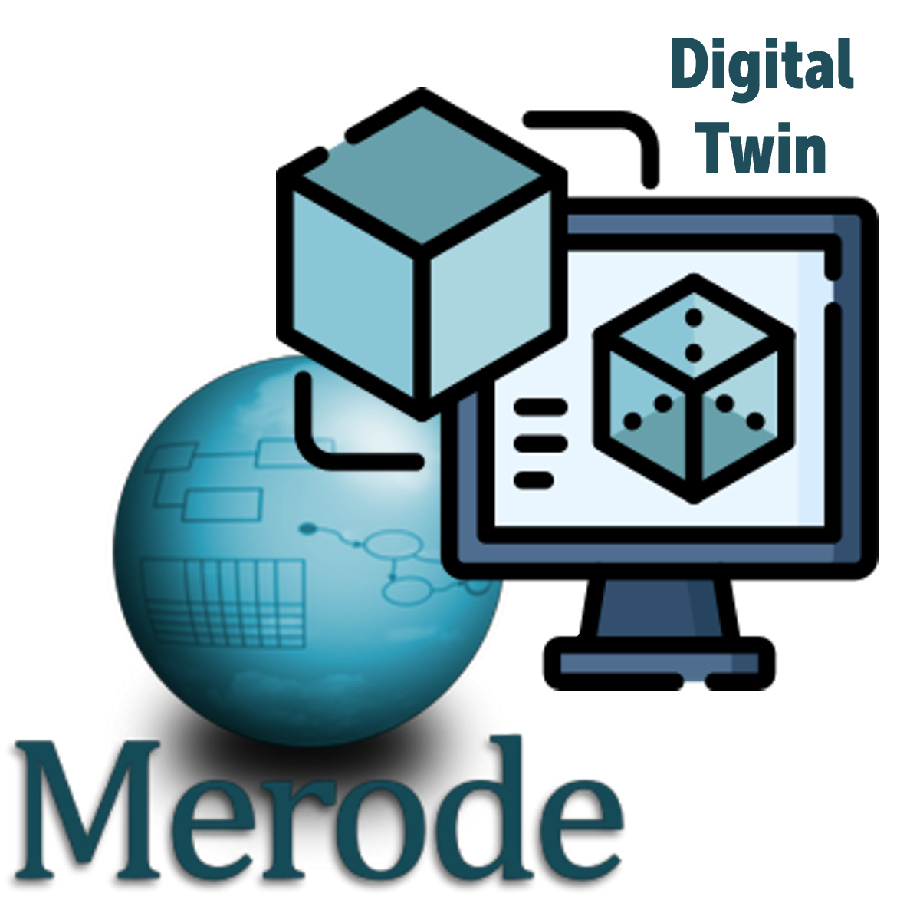

# ADAPTIVE-SHADOW

  
    
  
  

# Table of contents
<!--ts-->
   * [Functionalities](#functionalities)
   * [How to run](#how-to-run)
   * [Domain Model](#domain-model)
<!--te-->

# Functionalities

# How to run

# Domain Model

## The Web Application

The RESTful web application consists of a MAVEN project, offering a range of API services for each business event. The Domain Layer defines several business object types (EDG), each of which has a corresponding set of business event types specified in the Service Layer (OET). These business event types, which encompass actions such as creation, modification, termination, and more, can be performed through API services.

## The Java Prototype

The Java prototype encompasses a straightforward Graphical User Interface (GUI) displaying a list and details of the objects defined in the domain model. It also offers buttons for creating, modifying, and terminating object instances.
